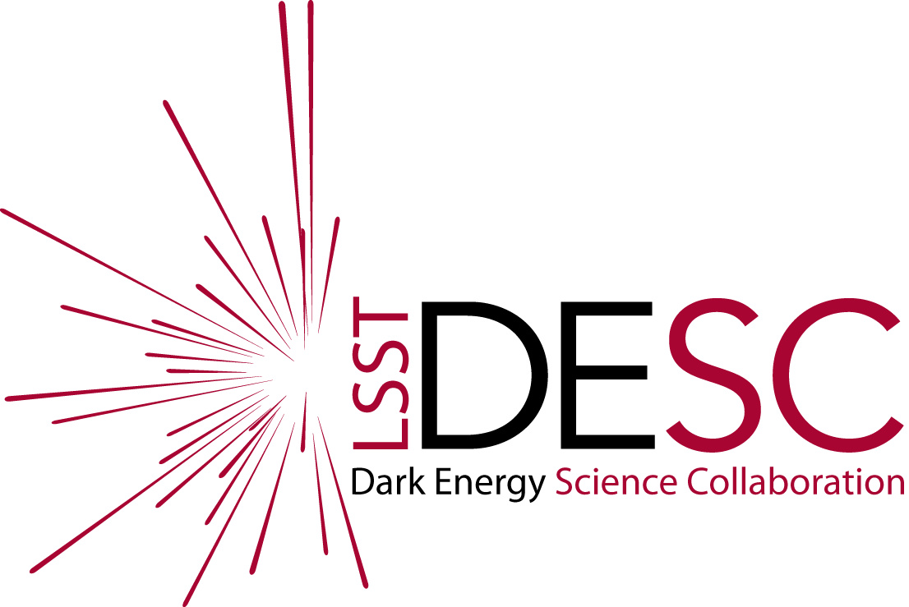

LSST DESC Notes Template and Author Guidelines
==============================================

*Heather Kelly (SLAC), Phil Marshall (SLAC)*

LSST DESC Notes are designed to be citeable, and so need to conform to
the expectations of the academic research community to some extent. They
should contain a short abstract, which should be placed here. In this
Note we outline the steps for starting a new LSST DESC Note, getting it
reviewed within the collaboration, and then "publishing" it (not in a
journal, but on the web nonetheless). We then provide a quick
introduction to preparing Notes in restructuredtext, highlighting
aspects of LSST DESC Note style, and giving some pointers to good
resources.

This Note was generated on: <add date here by hand>

Introduction
------------

This is a template markdown LSST DESC Note, for you to adapt for
your own work. It also contains instructions for how to get started
writing a note.

Getting Started
---------------

-   Fork the GitHub repository of your project if you haven't already.
-   Under the doc/LSST\_DESC\_Notes directory (which you might have to
    create), make a new subdirectory with a suitable name to contain
    your LSST DESC Note. This name needs to be unique to this
    repository, but need not contain the name of the repository.
-   Copy the [Computing Infrastructure LSST DESC Note
    template](https://github.com/DarkEnergyScienceCollaboration/ComputingInfrastructure/blob/master/doc/LSST_DESC_Notes/template_LSST_DESC_Note.rst) (i.e.
    this file) into your new directory, and rename it `index.rst`.
-   Edit your new index.rst file with the contents of your Note,
    following the guidelines in the template.
-   Add files for figures in a subfolder called \_static.
-   When your Note is complete and ready for review, submit a Pull
    Request to the base repo and ask your project's leads and/or your
    working group's conveners to review it.
-   The project leads will review your Note, iterate with you on
    modifications to it via the comments on the Pull Request, and
    finally merge it into the repository to signify that the Note
    is accepted. They will then tag the repo, to mark the first version
    of this LSST DESC Note.

Sectioning
----------

As you can see above, your content can easily be divided into sections.
You can also make subsections, as follows.

### A Subsection

You can even have subsubsections, like this:

#### A Subsubsection

See? This is a subsubsection.

#### Another Subsubsection

And so is this.

### Another Subsection

And so on.

Math
----

You can typeset mathematics using latex commands like this:

$$\langle f(k) \rangle = \frac{ \sum_{t=0}^{N}f(t,k) }{N}$$

While this does not render on GitHub, it should get [picked up by
Sphinx](http://www.sphinx-doc.org/en/stable/ext/math.html) later and
will be available for you to re-use in future latex documents.

Code
----

You can show code in blocks like this:

```python
print "Hello World"
```

or this:

```bash
echo "Hello World"
```

Inline mentions of code `objects` can be made using pairs of backquotes.

Figures
-------

To add figures, add the required image file (PNG, SVG or JPG preferred)
to the `_static` subdirectory in your Note's folder. Here's an example:


This is the figure caption: above we have the LSST DESC logo, in PNG format.

And then the text continues. Note that GitHub ignores the image sizing
commands when presenting reST format documents; Sphinx might not.

References
----------

You can cite papers (or anything else) by providing hyperlinks. For
example, you might have been impressed by the DESC White Paper [(LSST
Dark Energy Science Collaboration
2012)](http://arxiv.org/abs/1211.0310). It should be possible to convert
these links to latex citations automatically later.

Further Resources
-----------------

LSST DESC notes are styled after LSST technotes [(Sick
2016)](https://sqr-000.lsst.io/). You can also [view the restructured
text of (Sick
2016)](https://github.com/lsst-sqre/sqr-000/blob/master/index.rst).
Another nice example of an LSST technote is [(Wood-Vasey
2016)](http://dmtn-008.lsst.io/) - again, the restructured text is
visible
[here](https://github.com/lsst-dm/dmtn-008/blob/master/index.rst).

For a guide to reStructuredText writing, please see the [LSST docs reST
styleguide](http://docs.lsst.codes/en/latest/development/docs/rst_styleguide.html).
There are many other reST resources on the web, such as [this
cheatsheet](https://github.com/ralsina/rst-cheatsheet/blob/master/rst-cheatsheet.rst).
